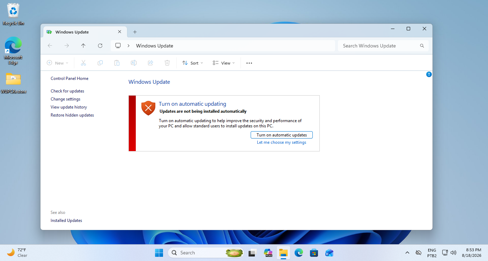

#  WUPCRestore
Restores old Windows Update CPL page for Windows 10

# 🤔 What is WUPCRestore?
WUPCRestore is automated Batchfile scripts that restores Windows Update CPL in Windows 10 and Windows 11

# ✅ What versions can run WUPCRestore?
This versions was confirmed to work:
- Windows 11 25H2 (Build 26200.8037)
- Windows 10 IoT Enterprise LSTC 2021 (Build 19044.1288 and Build 19044.7663)

# How does it runs?
- The files are copied from Windows 8.1, then downloaded and copied to System32 or System32/en-US

# 🐞 Known Bugs
- Clicking on "Turn automatic updates on" crash the page

# 🈚 Languages
- Only EN-US

# 🖼 Screenshots

